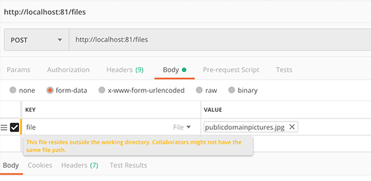

## Clone this repo

```bash
git clone https://github.com/dbx123/lumen-files-api.git
cd lumen-files-api
```

### Build & Run

```bash
docker-compose up --build -d
docker-compose exec php php ../artisan migrate:fresh --seed
```

Navigate to [http://localhost:81](http://localhost:81) and you should see the api is responding


### Stop Everything

```bash
docker-compose down
```

## Unit Tests

```bash
cd images/php/app
./vendor/bin/phpcs --standard=ruleset.xml app
./vendor/bin/phpunit tests --testdox
```

## API

GET         /files          - list files

GET         /files/{fileId} - get file by id

POST        /files          - store a file


DELETE      /files/{fileId} - delete a file

GET         /files/storage  - get current storage used

## Notes

used port 3307 for docker mysql, and 81 for nginx due to dev platform port collison
bash, libpng_devel, and php gd extension installed in php image for testing

seed database with : php artisan migrate:refresh --seed

file needs to be posted with the name 'file'
get file by id returns base64 encoded content with key base64_content
metadata of files are always returned (alter later when required)
